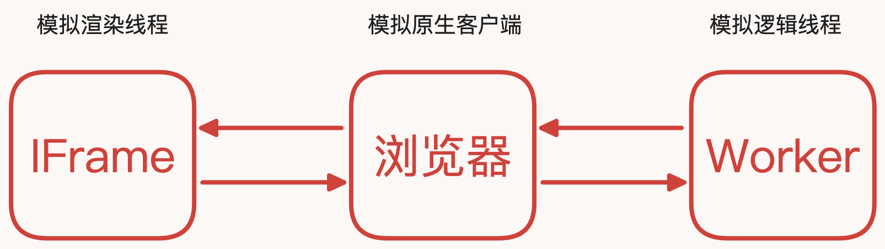

用浏览器来模拟小程序的运行环境，实现一个在浏览器端运行的小程序框架

- 用 `main.html` 模拟原生客户端
- 用 `iframe` 模拟 `webview`（渲染线程）
- 用 `worker` 模拟 `jscore`（逻辑线程）



我们先来看下他们之间的通信方式：

- `main.html` 与 `iframe` 通信
- `main.html` 与 `worker` 通信
- `iframe` 与 `worker` 通信

## main.html 与 iframe 通信

我们先来看下 `main.html` 与 `iframe` 之间的通信方式，这种通信有三种方式：

- `postMessage`
- 参数调用的形式，简称 `JSBridge`
- `params`

### postMessage

我们知道在 `iframe` 中通信父与子通信都可以使用 `postMessage`，如下代码：

`main.html` 代码如下：

- 获取到 `iframe` 标签后，通过 `iframe.contentWindow` 获取到 `iframe` 的 `window` 对象
- `postMessage` 会触发全局的 `message` 事件
  - 它只能监听到 `main.html` 中的 `message` 事件

```html
<body>
  main 页面
  <button id="button">向 iframe 发送消息</button>
  <iframe id="iframe" src="./iframe.html"></iframe>
  <script type="text/javascript">
    const iframe = document.getElementById("iframe");
    const button = document.getElementById("button");
    button.onclick = () => {
      // iframe 中有个属性 contentWindow
      iframe.contentWindow.postMessage("我是 main 页面", "*");
    };
    window.addEventListener("message", (e) => {
      console.log("监听来自 iframe 页面的消息：", e);
    });
  </script>
</body>
```

`iframe.html` 代码如下：

- `postMessage` 会触发 `message` 事件，但是它只能监听自身 `window` 上的 `message` 事件
  - `window.parent` 是获取到 `main.html` 上的 `window`，然后通过 `postMessage` 触发 `message` 事件

```html
<body>
  iframe 页面
  <button id="button">向 main 发送消息</button>
  <script type="text/javascript">
    const button = document.getElementById("button");
    button.onclick = () => {
      // iframe 向外面发送消息，window.parent 指向父页面
      window.parent.postMessage("我是 iframe 页面", "*");
    };
    window.addEventListener("message", (e) => {
      console.log("监听来自 main 页面的消息：", e);
    });
  </script>
</body>
```

### JSBridge

`JSBridge` 的方式是通过在 `window` 上挂载一个 `JSBridge` 的对象，然后在 `JSBridge` 上定义对应的方法给各自调用，原理如下：

```js
// main.html
iframe.contentWindow.JSBridge.onReceiveIframeMessage("我是 main");
iframe.contentWindow.JSBridge = {
  onReceiveMainMessage(msg) {
    console.log("接收来自 iframe 的消息：", msg);
  },
};

// iframe.html
window.JSBridge.onReceiveMainMessage("我是 iframe");
window.JSBridge = {
  onReceiveIframeMessage(msg) {
    console.log("接收来自 main 的消息", msg);
  },
};
```

`main.html` 代码如下：

- `main.html` 中定义一个 `onReceiveMainMessage` 的方法，接收来自 `iframe` 的消息
- 按钮触发 `onReceiveIframeMessage` 方法，向 `iframe` 发送消息

```html
<body>
  <button id="button">向 iframe 发送消息</button>
  <iframe id="iframe" src="./iframe.html"></iframe>

  <script type="text/javascript">
    const iframe = document.getElementById("iframe");
    const button = document.getElementById("button");
    button.onclick = () => {
      iframe.contentWindow.JSBridge.onReceiveIframeMessage("我是 main");
    };

    iframe.contentWindow.JSBridge = {
      onReceiveMainMessage: function (msg) {
        console.log("main 接收到 iframe 发来的消息：", msg);
      },
    };
  </script>
</body>
```

`iframe.html` 代码如下：

- `iframe.html` 定义一个 `onReceiveIframeMessage` 的方法，接收来自 `main` 的消息
- 按钮触发 `onReceiveMainMessage` 的方法，向 `main` 发送消息

```html
<body>
  iframe
  <button id="button">向 main 发送消息</button>
  <script type="text/javascript">
    const button = document.getElementById("button");
    button.onclick = () => {
      window.JSBridge.onReceiveMainMessage("我是 iframe");
    };
    window.JSBridge.onReceiveIframeMessage = function (msg) {
      console.log("iframe 接收来自 native 的消息：", msg);
    };
  </script>
</body>
```

### params

`params` 形式的通信只适用于父向子通信：`localhost:5173/home?name=uccs&age=1`

## main.html 与 Worker 通信

`js` 是运行的浏览器的主线程中，它与页面的渲染和用户的交互是共享同一个线程的，当执行复杂的渲染或者计算大量的数据时，`js` 就可能会阻塞主线程的运行，导致页面的卡顿

`Web Worker` 就是为了解决这个问题，它是浏览器提供的一种 `javascript api`，它允许在后台运行 `javascript`，从而避免干扰页面的正常渲染

所以 `Web Worker` 只能操作后台中的数据，无法直接操作 `DOM`，如果需要和 `DOM` 进行交互的话，需要调用 `Web Worker` 提供的 `api` 进行通信

它们之间的通信方式是通过 `postMessage`

`main.html` 代码如下：

- 创建一个 `Worker` 实例，传入 `worker.js` 文件
- `worker.onmessage` 监听来自 `worker` 的消息，也可以使用 `worker.addEventListener("message", (e) => {})` 来监听
- 按钮点击时，用 `worker.postMessage` 向 `worker` 中发送消息

```html
<body>
  main
  <button id="button">向 worker 发送消息</button>
  <script type="text/javascript">
    const button = document.getElementById("button");
    const worker = new Worker("./worker.js");
    button.onclick = () => {
      worker.postMessage("我是来自 main 的消息");
    };
    worker.onmessage = (e) => {
      console.log("main:", e);
    };
  </script>
</body>
```

`worker.js` 代码如下：

`Worker` 一加载就会执行 `console.log("hello worker")` 这行代码

在 `worker` 上下文中 `this` 指代 `Worker` 实例，`postMessage` 和 `onmessage` 都是 `Worker` 实例上的方法

- `postMessage` 向 `main` 发送消息
- `onmessage` 监听来自 `main` 的消息

```js
console.log("hello worker");
postMessage("我是来自 worker 的消息");
onmessage = (e) => {
  console.log("接收来自 main 的消息:", e.data);
};
```

## iframe 与 worker 通信

`iframe` 和 `worker` 之间的通信可以理解为一个简单的双线程的通信：在主线程 `main.html` 中分别加载 `worker` 和 `iframe`

其中 `worker` 作为逻辑线程，`iframe` 作为渲染线程

当逻辑线程需要修改页面 `ui`，需要通知渲染线程执行相应的逻辑：

1. 逻辑线程通过 `postMessage` 向 `main.html` 发送消息
2. `main.html` 接收到消息后，通过 `JSBridge` 向渲染线程发送消息
3. 渲染线程接收到消息后，执行相应的操作，更新 `ui`

当渲染线程有事件触发时，就需要通知逻辑线程执行相应的逻辑：

1. 渲染线程通过 `JSBridge` 向 `main.html 发送消息
2. `main.html` 接收到消息后，通过 `postMessage` 向逻辑线程发送消息
3. 逻辑线程收到消息后，执行相应的操作（逻辑线程执行完成后，如果不需要更新 `ui` 则无需进行下面 `3` 步）
4. 执行完成之后在通过 `postMessage` 向 `main.html` 发送消息
5. `main.html` 接收到消息后，通过 `JSBridge` 向渲染线程发送消息
6. 渲染线程接收到消息后，执行相应的操作，更新 `ui`

在一个双线程的架构中，我们需要完成两件事情

1. 将逻辑线程的数据渲染在渲染线程
2. 渲染线程调用逻辑线程的更新函数，然后在将修改的数据发送到渲染线程进行渲染

主线程 `main.html` 代码如下：

- 监听来在 `worker` 中的消息
  - 接收到消息后，通过 `JSBridge`，调用 `iframe` 中的 `onReceiveIframeMessage` 向 `iframe` 发送消息
- 在 `iframe.contentWindow` 中定义一个 `JSBridge` 对象，用来接收来自 `iframe` 的消息
  - 接收到消息后，通过 `postMessage` 向 `worker` 发送消息

```html
<body>
  <iframe id="iframe" src="./iframe.html"></iframe>
  <script type="text/javascript">
    const iframe = document.getElementById("iframe");
    const worker = new Worker("./worker.js");

    // 监听 worker 发来的消息
    worker.addEventListener("message", (e) => {
      console.log("main 接收来自 worker 的消息:", e.data);
      // 像 iframe 发送消息
      iframe.contentWindow.JSBridge.onReceiveIframeMessage(e.data);
    });
    iframe.contentWindow.JSBridge = {
      // 接收来自 iframe 的消息
      onReceiveMainMessage(msg) {
        console.log("main 接收来自 iframe 的消息:", msg);
        // 向 worker 发送消息
        worker.postMessage(msg);
      },
    };
  </script>
</body>
```

渲染线程 `iframe.html`，代码如下：

- 在 `iframe` 中定义一个 `JSBridge` 对象，用来接收来自 `main` 的消息
  - 接收到消息后，更新页面的 `ui`
- 当页面有点击事件时，通过 `JSBridge`，调用 `main` 中的 `onReceiveMainMessage` 方法，向 `main` 发送消息

```html
<body>
  <button id="button">更新文案</button>
  <p id="text"></p>
  <script type="text/javascript">
    const button = document.getElementById("button");
    const p = document.getElementById("text");
    button.onclick = () => {
      // 向 main 发送消息，将调用的函数传递过去
      window.JSBridge.onReceiveMainMessage("updateData");
    };

    // 监听来自 main 的消息
    window.JSBridge.onReceiveIframeMessage = (msg) => {
      console.log("iframe 收到来自 main 的消息", msg);
      text.innerHTML = msg;
    };
  </script>
</body>
```

逻辑线程 `worker.js`，代码如下

- 初始化渲染调用 `postMessage` 向 `main` 发送消息
- 监听来在 `main` 中的消息
  - 接收到消息后，调用 `page` 对象中的更新函数 `updateData` 更新 `data` 中的属性
  - 数据更新完成后，调用 `postMessage` 向 `main` 发送消息

```js
const global = this;
// 监听来自 main 的消息
addEventListener("message", (e) => {
  console.log("worker 收到 main 的消息：", e.data);
  // 调用更新函数进行状态更新
  page[e.data]();
});

const page = {
  data: {
    text: "我是来自 worker 的数据",
  },

  updateData() {
    this.data.text += "!!!";
    // 状态更新完成后，向 main 发送消息
    global.postMessage(page.data.text);
  },
};

const initPage = () => {
  // 初始化页面，向 main 发送消息
  global.postMessage(page.data.text);
};
setTimeout(() => {
  initPage();
}, 1000);
```

## 总结

1. 在单线程架构中，逻辑线程的代码和渲染线程的都在主线程中，没有通信一说
2. 在双线程架构中，逻辑线程、渲染线程、主线程都是各自独立的，无法直接访问，只能通过跨线程通信的方式进行访问
